# A Letter Groove

Produce images like cut-page artists' books from digitized archives.

[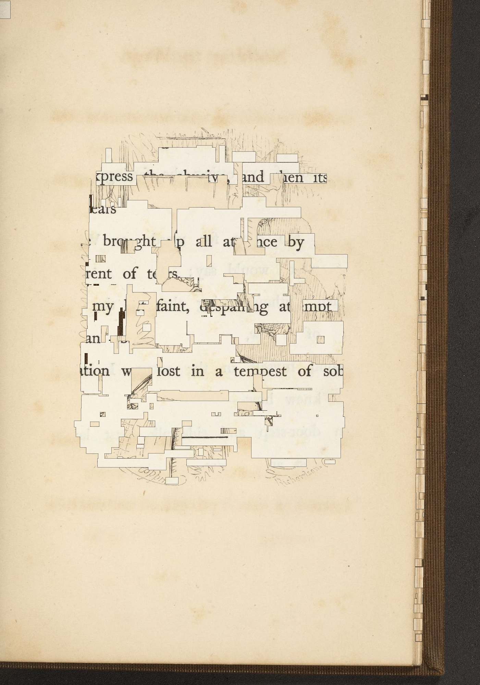](examples/screenshot-16.png) [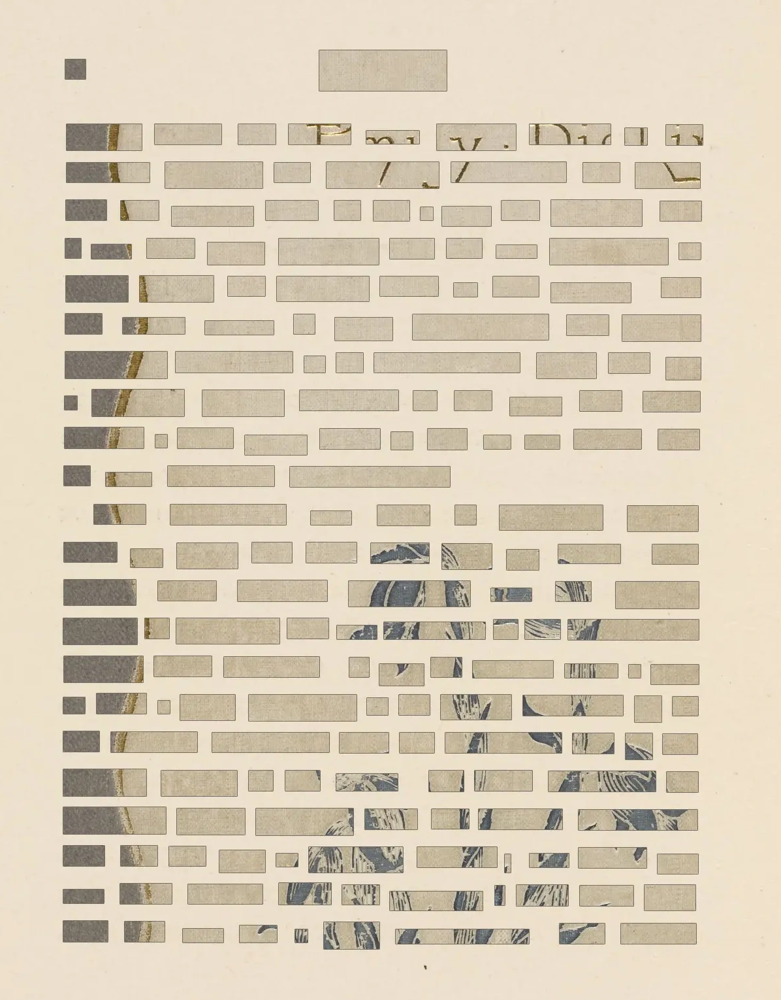](examples/dickenson1.png) [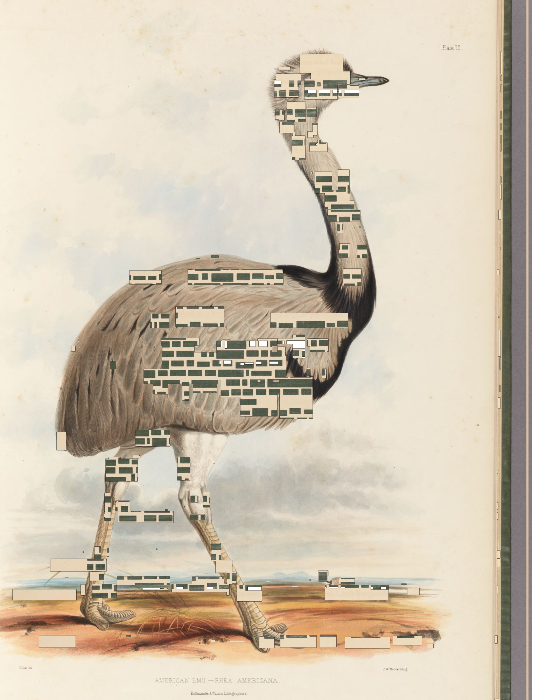](examples/menagerie1.png) [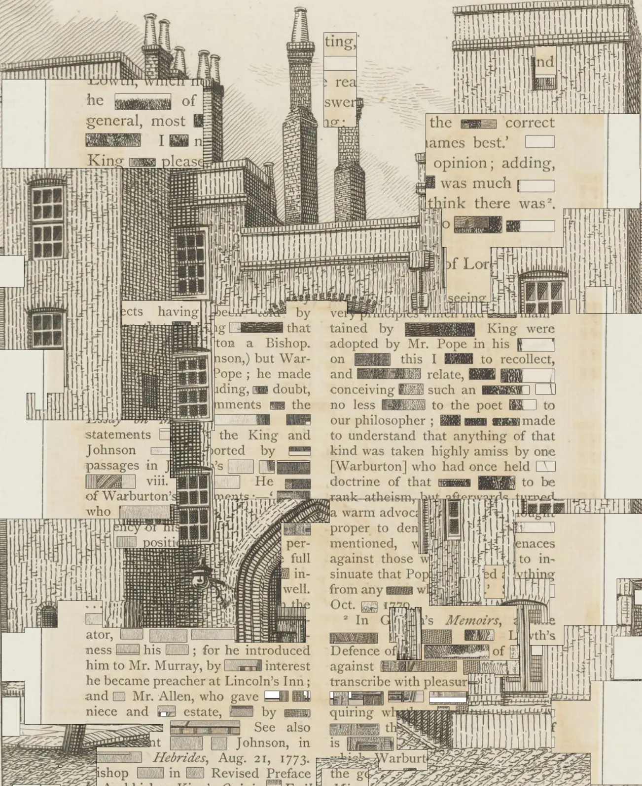](examples/the-life-of-samuel-johnson-6.png) [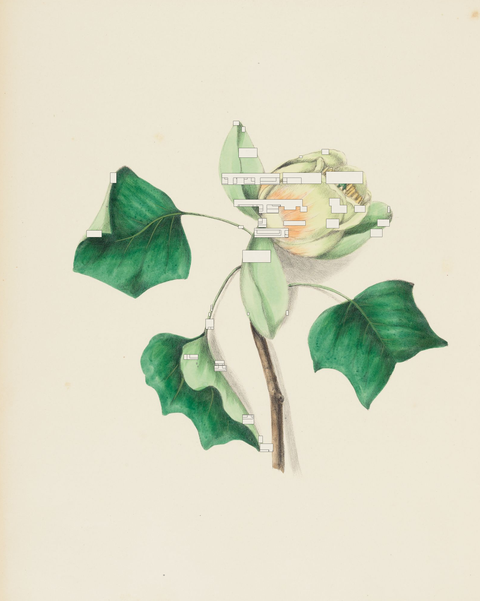](examples/flowers1.png)[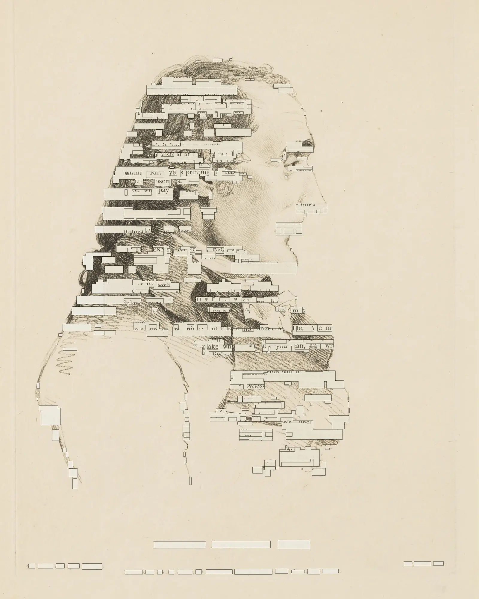](examples/the-life-of-samuel-johnson-2.png)

## How it works

1. Paste a [IIIF manifest](https://iiif.io/get-started/how-iiif-works/) URL from any library or archive
2. [Tesseract.js](https://tesseract.projectnaptha.com/) OCR identifies words on each scanned page
3. Words are randomly cut out, revealing the pages beneath

The result is a layered visual composition in the style of cut-page artists' books.

## Using the app

**[Launch the app](https://lizadaly.github.io/a-letter-groove/)** — includes example books to get started.

IIIF (International Image Interoperability Framework) is an API for describing image sequences, used by libraries, museums, and archives worldwide. Both IIIF Presentation API v2 and v3 manifests are supported.

## More examples

[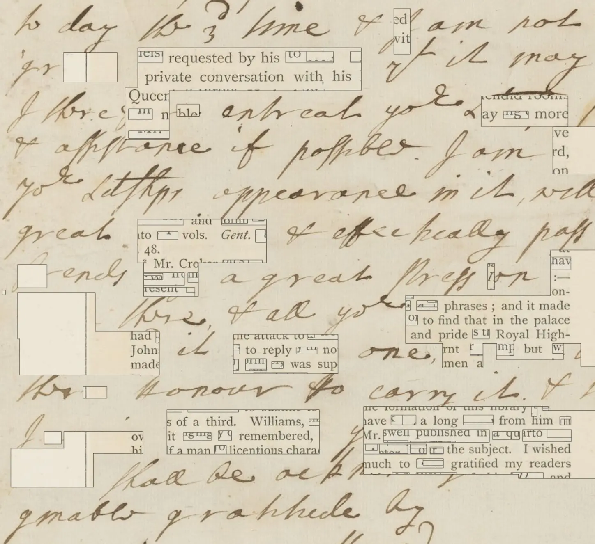](examples/the-life-of-samuel-johnson-5.png)
[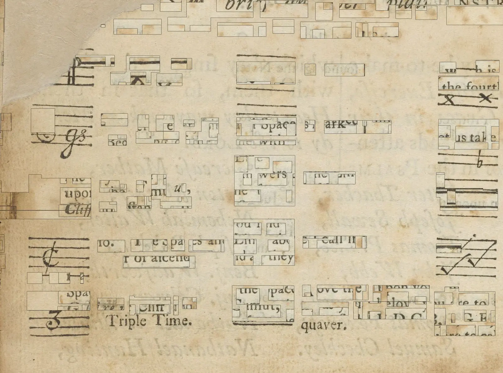](examples/music2.png)

[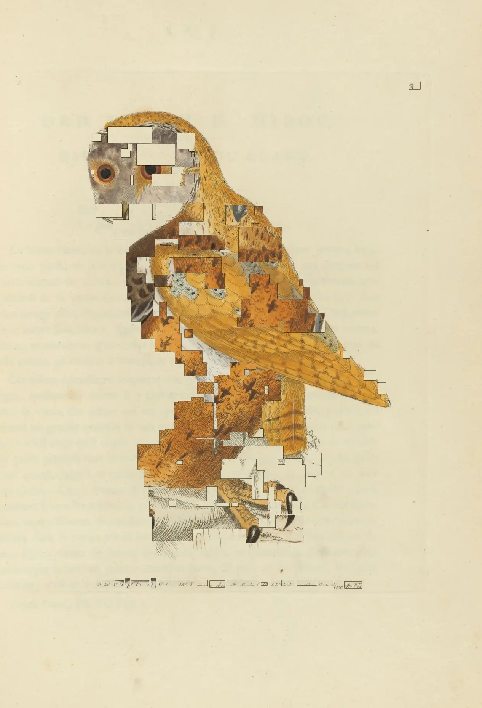](examples/owl.png)
[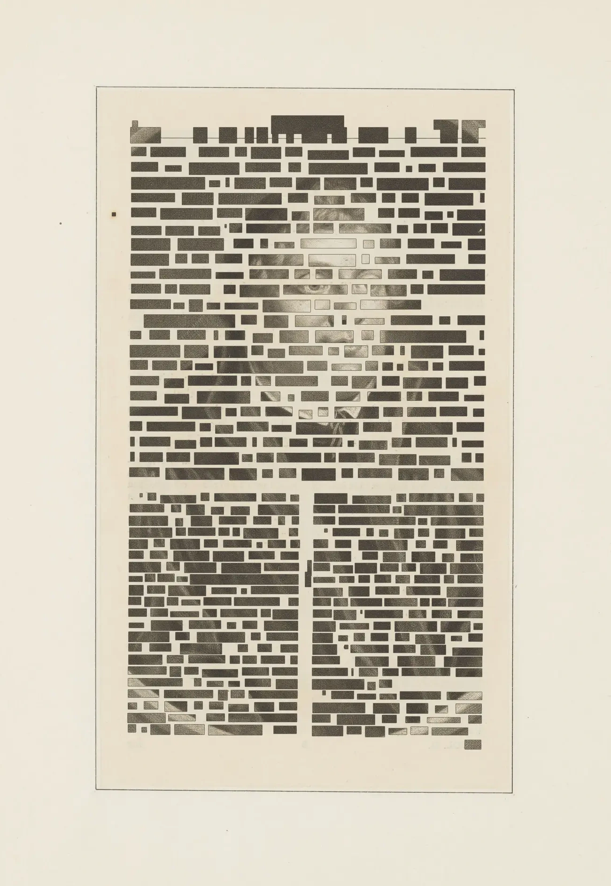](examples/screenshot-4.png)
[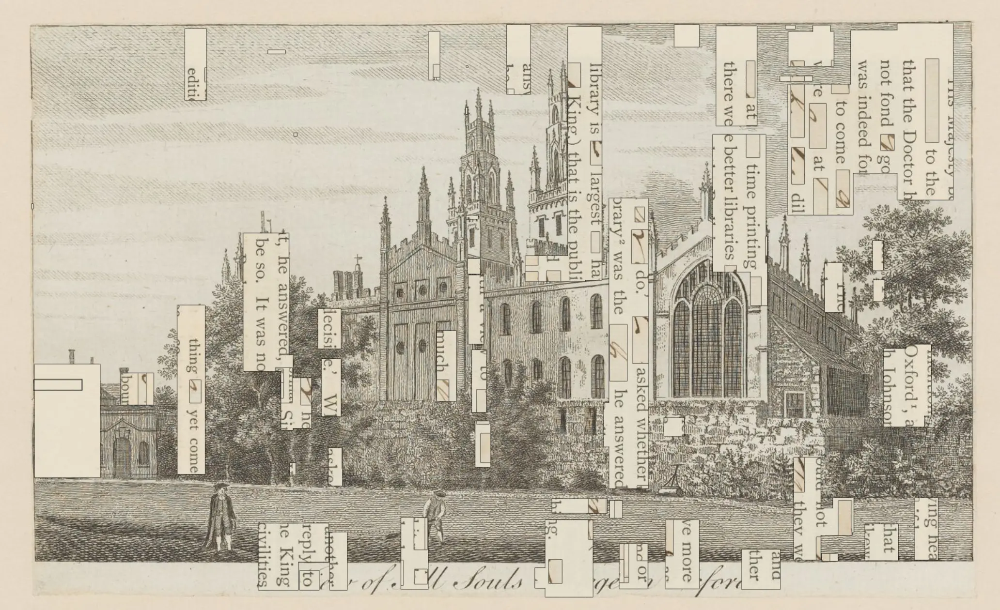](examples/the-life-of-samuel-johnson-4.png)
[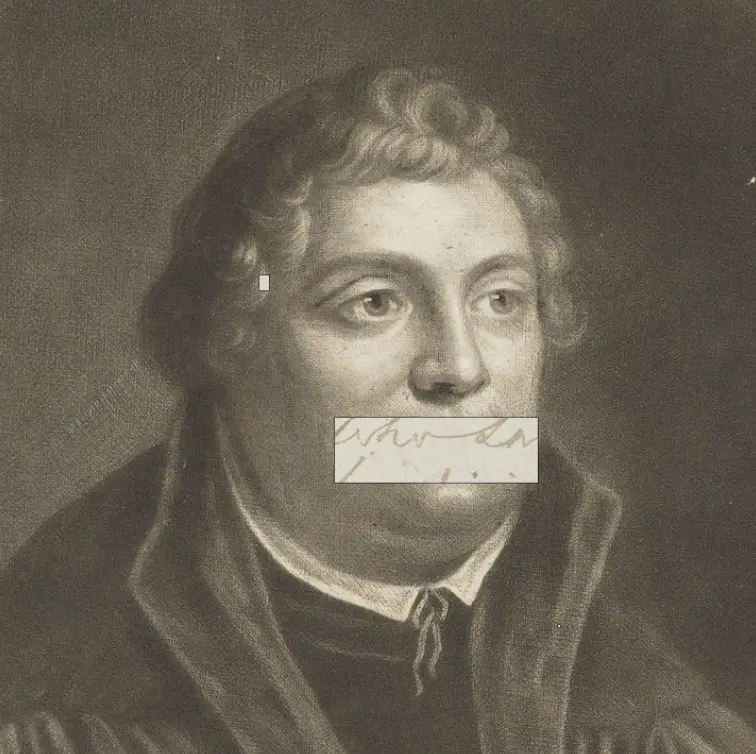](examples/the-life-of-samuel-johnson-3.png)

## Background

Originally a [NaNoGenMo](https://nanogenmo.github.io/) 2022 project with a simpler interface. The title comes from output produced when cutting up an edition of Emily Dickinson's poetry.

