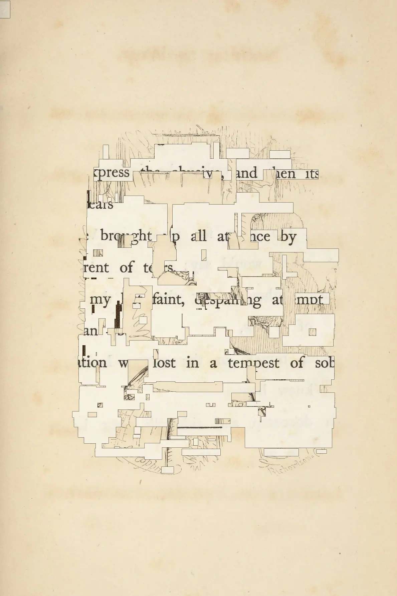
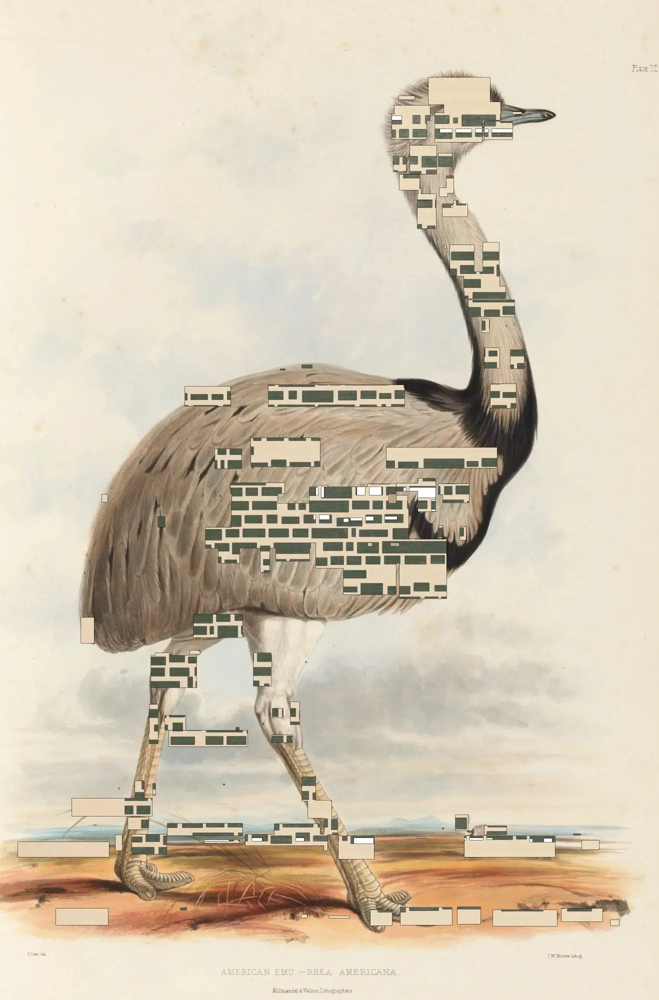
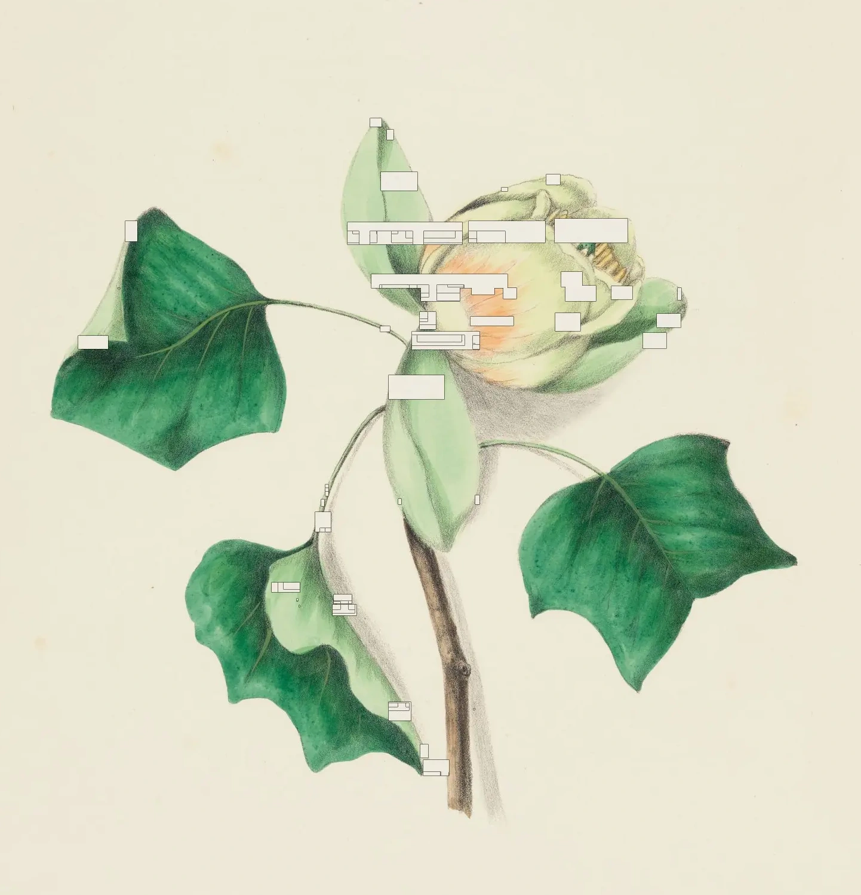

# A Letter Groove

A project for NaNoGenMo 2022 to produce cut pages in the style of artists' books.

Given a URL of an <a href="https://iiif.io/get-started/how-iiif-works/">IIIF manifest</a> pointing at a series of scanned book pages, produce a new book that cuts out words revealing the pages beneath. (IIIF is an API and data format for describing image sequences for use in academia and research, and can be applied to individual documents, maps, books, or ephemera.)

[](examples/screenshot-16.png) [](examples/dickenson1.png) [](examples/menagerie1.png) [](examples/the-life-of-samuel-johnson-6.png) [](examples/flowers1.png) [](examples/music2.png)


[The webapp](https://lizadaly.github.io/a-letter-groove/) can be used directly to view page output. (I have only tried this with Harvard's IIIF content and server so your mileage may vary with other sources.)

The "official" NaNoGenMo entry is 99 pages produced from [Boswell's Life of Johnson](https://lizadaly.com/projects/a-letter-groove/boswells-life-of-johnson-sm.pdf) (26MB PDF). <i>Boswell, James, 1740-1795. Boswell's Life of Johnson, extra-illustrated, 1464-1897. MS Hyde 76, vol. 2, pt. 1. Houghton Library, Harvard University, Cambridge Mass.</i>


The title comes from output produced when cutting up an edition of [Emily Dickenson's poetry](https://lizadaly.com/projects/a-letter-groove/emily-dickenson-poems-sm.pdf) (11MB PDF).

# Local usage

You probably don't want to bother!

To generate PDF book output, you'll need to install and run it yourself. It will install Vite to run the local webserver, and Playwright to run the browser automation to walk through an entire book. TesseractJS is imported directly from the HTML.

```bash
npm install

# Configure `playwright.config.js` to capture your IIIF manifest and tweak the PDF output

# Then run the browser automation
npm run test
```

Individual screenshots will end up in `output/`. The simplest way to turn them into a PDF is with ImageMagick:

```
cd output/
convert *.png your-file.pdf
```


